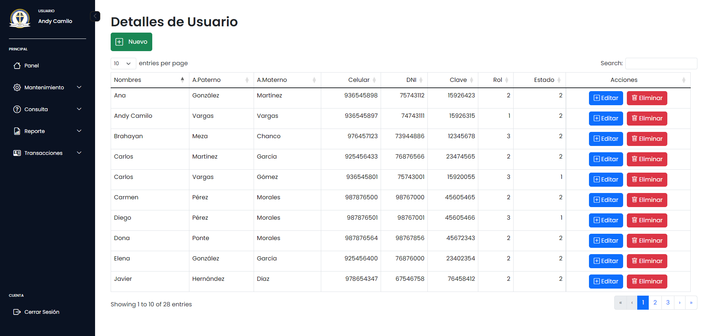
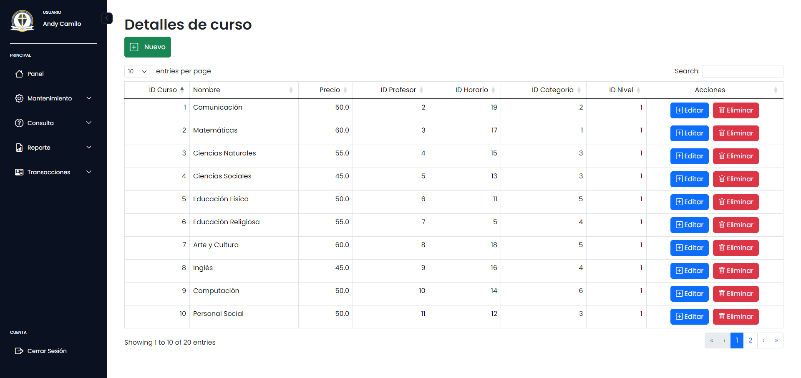
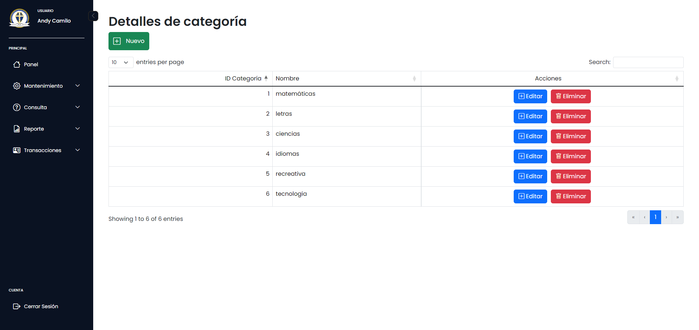
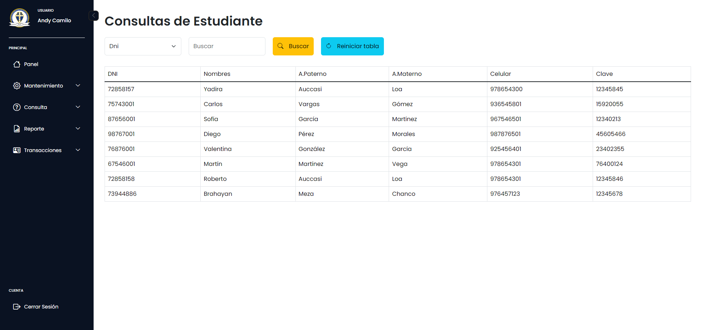
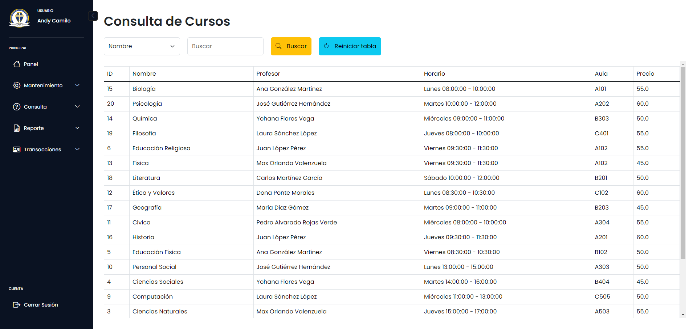
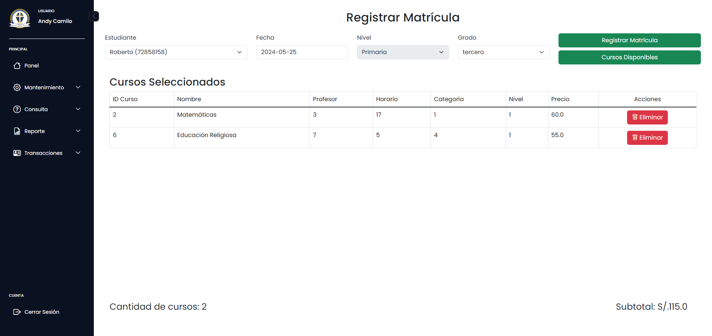
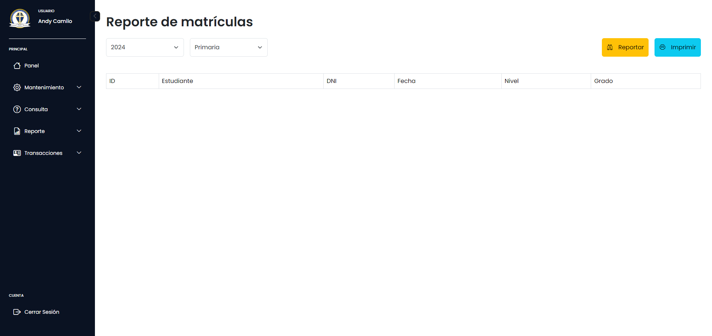
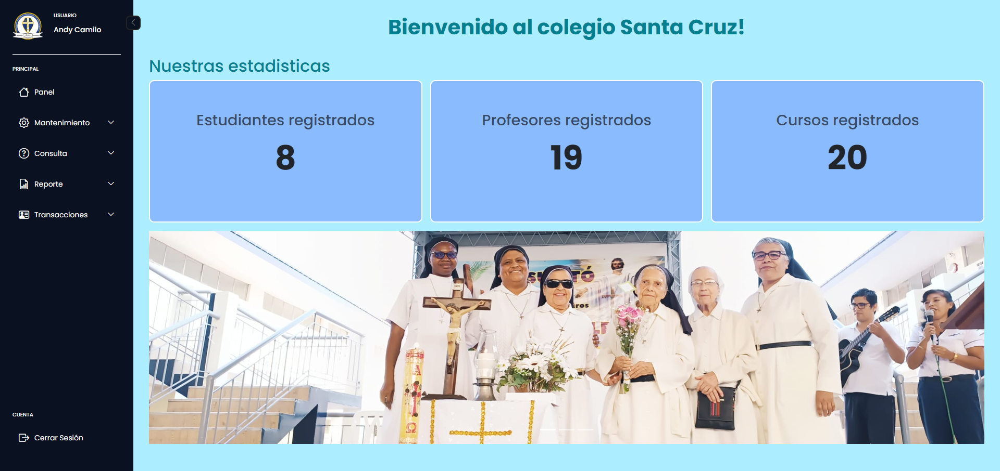

# ¡Bienvenido al Sistema de Gestión de Matrículas Escolares del Colegio Santa Cruz! 🎓

## Descripción del Proyecto
¡Hola! Este es el Sistema de Gestión de Matrículas Escolares del Colegio Santa Cruz, ¡donde simplificamos la gestión de inscripciones con una pizca de alegría! Además de matricular estudiantes, también ofrecemos una experiencia interactiva para que todos se sientan parte de la comunidad escolar.

## ¿Cómo Funciona?
¡Es sencillo! Los administradores pueden iniciar sesión directamente y registrar a los estudiantes en el sistema cuando llegan a matricularse. Los alumnos, por otro lado, pueden crear su propia cuenta ingresando su DNI y eligiendo una contraseña. ¡Y listo, están dentro!

## Contenido Actual
Actualmente, los alumnos y profesores pueden ingresar al sistema, ¡aunque aún no hay contenido para ellos! Pero no te preocupes, ¡próximamente habrá mucho más!

## Módulos para Administradores
Los administradores tienen acceso a cuatro módulos principales:

1. **Mantenimiento**
   - **Usuarios**: Registra, edita, elimina y busca usuarios.
     - 
   
   - **Cursos**: Registra, edita, elimina y busca cursos.
     - 
   
   - **Categorías**: Registra, edita, elimina y busca categorías.
     - 

2. **Consultas**
   - **Estudiantes**: Busca información sobre estudiantes.
     - 
   
   - **Cursos**: Busca información sobre cursos.
     - 

3. **Transacciones**
   - **Registro de Matrícula**: Registra matrículas para los estudiantes.
     - 

4. **Reportes**
   - **Reporte de Matrículas**: Genera informes detallados sobre las matrículas.
     - 

## Panel Principal de Bienvenida
Al iniciar sesión, te recibirá nuestro encantador panel principal, donde encontrarás estadísticas divertidas como usuarios registrados y matriculados. Además, ¡disfruta de un banner con imágenes del Colegio Santa Cruz para animar tu día!
   - 

## Alegre y Funcional
El sistema también incluye alertas y validaciones para una experiencia de usuario más fluida y segura. Hemos utilizado las siguientes tecnologías:

- **Backend**: MySQL, Java, JSP, Servlets
- **Frontend**: HTML, CSS, JavaScript, Bootstrap, jQuery
- **Librerías**: SuiteAlert, iText
